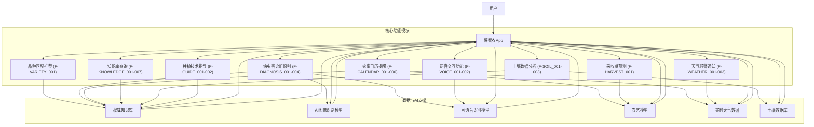
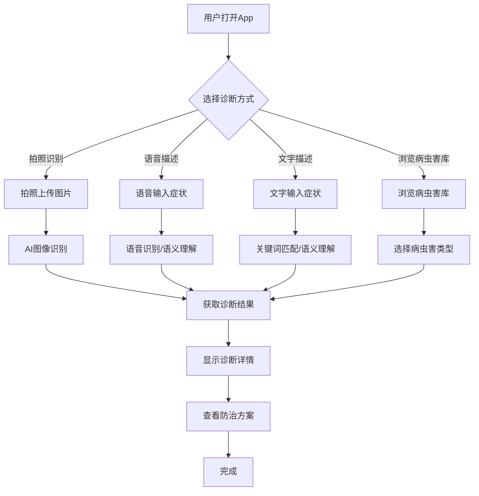
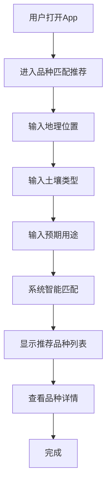
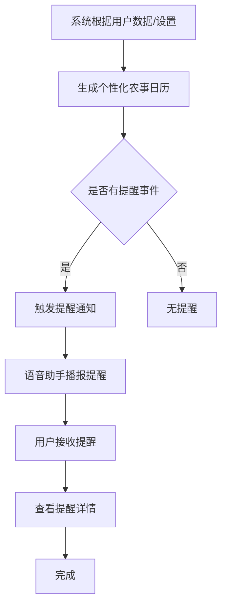
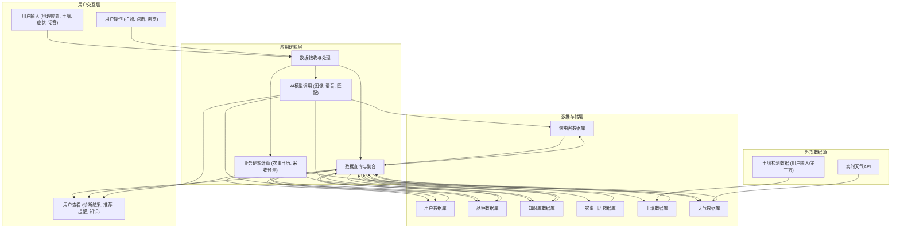

# 薯智农产品需求文档

## 1. 产品概述

### 1.1 产品名称与定位

*   **产品名称:** 薯智农
*   **产品定位:** 一款专为福建甘薯种植户设计的移动端智能问答专家应用，提供全周期的农技支持与知识服务。
*   **产品应用语言:** 中文

### 1.2 产品愿景与目标

*   **产品愿景:** 成为福建甘薯种植户随身的“数字农技专家”，将复杂的农业知识转化为简单、实用的田间解决方案，助力农业现代化和增产增收。
*   **产品目标:**
    *   提升福建甘薯种植户的种植技术水平和病虫害防治能力。
    *   实现甘薯种植全周期的智能化管理，提高生产效率。
    *   建立权威、动态更新的甘薯种植知识库，确保信息的准确性和时效性。
    *   通过便捷的语音交互和图像识别，降低用户使用门槛，惠及更广泛的农户群体。

### 1.3 产品使用终端

*   **终端类型:** 移动端App (支持 iOS 和 Android 操作系统)

### 1.4 核心价值主张

*   **专业权威:** 基于动态更新的权威知识库，提供科学、准确的农技指导。
*   **智能便捷:** 结合AI图像识别、语音交互和个性化推荐，实现快速诊断、精准匹配和主动提醒。
*   **全周期覆盖:** 从种前规划到种后管理，再到采收存储，提供一站式解决方案。
*   **普适易用:** 针对农户使用习惯优化，支持语音交互，确保操作简单直观。

### 1.5 目标用户群体分析

*   **专业甘薯种植户:** 拥有一定种植经验，追求更高产量和品质，需要精准的技术指导和问题解决方案。
*   **家庭农场主:** 管理规模较大，需要高效的农事管理工具和及时的病虫害预警。
*   **农业合作社成员:** 作为集体组织的一员，需要共享农技知识和统一的管理标准。
*   **农业技术推广人员:** 需要便捷的工具来辅助指导农户，或获取最新的农技信息。
*   **农业初学者:** 缺乏种植经验，需要系统的基础知识学习和入门级指导。

### 1.6 市场需求与竞品简析

*   **市场需求:**
    *   **信息获取痛点:** 传统农技知识获取渠道有限、信息滞后、专业性不足，农户难以快速获取准确的种植指导。
    *   **病虫害诊断难题:** 农户对病虫害识别能力有限，易导致误判和滥用农药，影响产量和品质。
    *   **个性化管理缺失:** 缺乏针对特定品种、土壤、气候条件的个性化农事建议。
    *   **技术推广效率:** 传统农技推广方式效率低下，难以覆盖广大农户。
*   **竞品简析:**
    *   **综合性农业App:** 如“农技耘”、“云上智农”等，提供广泛的农业知识和服务，但可能在甘薯细分领域不够深入，或缺乏针对福建地区的定制化内容。
    *   **单一功能工具:** 如病虫害识别App、天气App等，功能单一，无法提供全周期、一体化的解决方案。
    *   **本产品优势:** 专注于福建甘薯种植，提供深度定制化的知识和服务，结合AI技术实现智能化、个性化支持，形成差异化竞争优势。

## 2. 功能规格

### 2.1 功能详述

#### 2.1.1 品种匹配推荐

| 功能ID | 功能名称 | 功能描述 | 优先级 |
|--------|---------|---------|--------|
| F-VARIETY_001 | 品种匹配推荐 | 用户输入地理位置、土壤类型、预期用途等信息，系统基于内置算法和知识库，智能推荐最适合的甘薯品种，并提供品种特性、种植要点等详细信息。 | P0 |

#### 2.1.2 病虫害诊断识别

| 功能ID | 功能名称 | 功能描述 | 优先级 |
|--------|---------|---------|--------|
| F-DIAGNOSIS_001 | 拍照识别 | 用户拍摄甘薯植株（叶片、茎、果实等）的异常部位，系统通过AI图像识别技术，快速诊断病虫害类型，并提供详细的诊断结果、发生规律、防治方法及用药建议。 | P0 |
| F-DIAGNOSIS_002 | 语音描述提问 | 用户通过语音描述病虫害症状，系统进行语音识别并结合知识库进行智能匹配，提供可能的病虫害诊断结果及防治方案。 | P0 |
| F-DIAGNOSIS_003 | 症状文字描述输入 | 用户通过文字输入病虫害症状，系统进行关键词匹配和语义理解，提供可能的病虫害诊断结果及防治方案。 | P0 |
| F-DIAGNOSIS_004 | 病虫害库分类浏览 | 用户可按病虫害类型（病害、虫害）、发生部位、症状表现等分类浏览病虫害知识库，查看详细信息和防治方法。 | P0 |

#### 2.1.3 农事日历提醒

| 功能ID | 功能名称 | 功能描述 | 优先级 |
|--------|---------|---------|--------|
| F-CALENDAR_001 | 播种时间提醒 | 根据用户选择的品种、地理位置和当地气候，智能计算并提醒最佳播种时间。 | P0 |
| F-CALENDAR_002 | 施肥时期提醒 | 根据作物生长阶段、土壤肥力和品种特性，智能推荐施肥种类、用量和最佳施肥时期，并进行提醒。 | P0 |
| F-CALENDAR_003 | 病虫害防治时期提醒 | 结合病虫害发生规律、天气预测和作物生长阶段，提前提醒用户进行病虫害预防和防治。 | P0 |
| F-CALENDAR_004 | 灌溉时机提醒 | 根据土壤墒情、天气预测和作物需水规律，智能提醒用户进行灌溉。 | P0 |
| F-CALENDAR_005 | 采收期提醒 | 根据品种特性、生长周期和农艺模型预测，提醒用户最佳采收期。 | P0 |
| F-CALENDAR_006 | 语音助手播报 | 农事提醒通过语音助手进行播报，确保用户在田间也能及时接收信息。 | P0 |

#### 2.1.4 采收期预测

| 功能ID | 功能名称 | 功能描述 | 优先级 |
|--------|---------|---------|--------|
| F-HARVEST_001 | 采收期预测 | 基于农艺模型、品种特性、种植日期和实时生长数据（如用户输入或传感器数据），预测甘薯的最佳采收期，以确保品质和产量。 | P0 |

#### 2.1.5 知识库查询

| 功能ID | 功能名称 | 功能描述 | 优先级 |
|--------|---------|---------|--------|
| F-KNOWLEDGE_001 | 甘薯品种介绍 | 提供福建地区常见及推荐甘薯品种的详细介绍，包括品种特性、产量表现、抗性、适宜种植区域等。 | P0 |
| F-KNOWLEDGE_002 | 种植技术教程 | 提供从育苗、移栽、田间管理到收获的全流程种植技术教程，包含图文、视频等多种形式。 | P0 |
| F-KNOWLEDGE_003 | 病虫害防治方法 | 详细介绍各类甘薯病虫害的识别特征、发生规律、综合防治措施和安全用药指南。 | P0 |
| F-KNOWLEDGE_004 | 施肥用药指南 | 提供科学的施肥方案、肥料种类选择、农药使用规范和安全间隔期等信息。 | P0 |
| F-KNOWLEDGE_005 | 土壤改良方案 | 针对福建地区常见土壤问题，提供土壤检测、改良方法和培肥建议。 | P0 |
| F-KNOWLEDGE_006 | 采收存储技术 | 提供甘薯采收后的处理、分级、包装和科学存储技术，延长保鲜期。 | P0 |
| F-KNOWLEDGE_007 | 气象灾害应对 | 提供福建地区常见气象灾害（如台风、暴雨、干旱等）的预警信息和防灾减灾措施。 | P0 |

#### 2.1.6 语音交互功能

| 功能ID | 功能名称 | 功能描述 | 优先级 |
|--------|---------|---------|--------|
| F-VOICE_001 | 语音问答 | 用户可通过语音直接向应用提问，系统进行语音识别并提供相应的知识解答或功能引导。 | P0 |
| F-VOICE_002 | 语音控制 | 用户可通过语音指令控制应用的部分功能，如“打开病虫害诊断”、“查询今日农事”等。 | P0 |

#### 2.1.7 天气预警通知

| 功能ID | 功能名称 | 功能描述 | 优先级 |
|--------|---------|---------|--------|
| F-WEATHER_001 | 实时天气查询 | 提供用户当前位置的实时天气信息，包括温度、湿度、风力、降水等。 | P0 |
| F-WEATHER_002 | 未来天气预报 | 提供未来7天的天气预报，帮助用户规划农事活动。 | P0 |
| F-WEATHER_003 | 灾害性天气预警 | 接收并推送政府发布的台风、暴雨、干旱、冰雹等灾害性天气预警信息。 | P0 |

#### 2.1.8 土壤数据分析

| 功能ID | 功能名称 | 功能描述 | 优先级 |
|--------|---------|---------|--------|
| F-SOIL_001 | 土壤数据录入 | 用户可手动输入土壤检测数据（如pH值、有机质含量、氮磷钾含量等）。 | P0 |
| F-SOIL_002 | 土壤肥力评估 | 根据用户输入的土壤数据，系统进行土壤肥力评估，并给出改良建议。 | P0 |
| F-SOIL_003 | 土壤改良建议 | 结合土壤评估结果和知识库，提供针对性的土壤改良方案和施肥建议。 | P0 |

#### 2.1.9 种植技术指导

| 功能ID | 功能名称 | 功能描述 | 优先级 |
|--------|---------|---------|--------|
| F-GUIDE_001 | 全周期种植指南 | 提供从种前准备到采收的详细种植技术指导，包括育苗、移栽、中耕除草、水肥管理、病虫害防治等。 | P0 |
| F-GUIDE_002 | 关键农事操作提示 | 在特定生长阶段，主动推送关键农事操作提示，如“甘薯膨大期需增施钾肥”。 | P0 |

### 2.2 功能模块间的关系图

## 3. 用户流程

### 3.1 用户旅程地图

| 阶段       | 用户目标                       | 用户行为                               | 触点/功能点                                  | 痛点                       | 解决方案/体验提升                          |
| :--------- | :----------------------------- | :------------------------------------- | :------------------------------------------- | :------------------------- | :----------------------------------------- |
| **种前规划** | 选择合适品种，做好备耕         | 咨询品种、了解土壤、规划种植           | 品种匹配推荐、土壤数据分析、知识库（品种介绍） | 品种选择困难、土壤状况不明 | 智能推荐、土壤评估、详细知识               |
| **种植过程** | 确保作物健康生长，及时防治病虫害 | 日常巡查、发现异常、寻求帮助、执行农事 | 病虫害诊断、农事日历、语音交互、天气预警     | 病虫害识别难、农事操作遗忘 | 快速诊断、智能提醒、语音指导、天气预警     |
| **收获管理** | 把握最佳采收期，科学存储       | 观察成熟度、咨询采收时间、学习存储技术 | 采收期预测、知识库（采收存储）               | 采收时机不当、存储损耗大   | 精准预测、专业存储指导                     |
| **知识学习** | 提升种植技能                   | 主动学习、查阅资料                     | 知识库、语音问答                             | 知识碎片化、获取不便       | 系统知识体系、便捷查询                     |

### 3.2 关键路径流程图

#### 3.2.1 病虫害诊断流程

#### 3.2.2 品种匹配推荐流程

#### 3.2.3 农事日历提醒流程

### 3.3 各场景下的用户操作步骤

#### 3.3.1 病虫害诊断（拍照识别）

1.  **用户操作:** 打开薯智农App。
2.  **用户操作:** 点击首页的“病虫害诊断”入口。
3.  **用户操作:** 在病虫害诊断页（P-DISEASE_DIAGNOSIS）选择“拍照识别”。
4.  **用户操作:** 拍摄甘薯植株异常部位的清晰照片。
5.  **系统反馈:** 系统进行AI图像识别，并显示诊断结果。
6.  **用户操作:** 查看诊断结果详情，包括病虫害名称、症状描述、发生规律。
7.  **用户操作:** 点击“查看防治方案”按钮。
8.  **系统反馈:** 显示详细的防治方法、推荐农药及使用注意事项。
9.  **用户操作:** 完成诊断。

#### 3.3.2 品种匹配推荐

1.  **用户操作:** 打开薯智农App。
2.  **用户操作:** 点击首页的“品种匹配”入口。
3.  **用户操作:** 在品种匹配页（P-VARIETY_MATCH）输入地理位置（如福建省XX市XX县）。
4.  **用户操作:** 输入土壤类型（如沙壤土、红壤）。
5.  **用户操作:** 输入预期用途（如鲜食、淀粉加工）。
6.  **用户操作:** 点击“开始匹配”按钮。
7.  **系统反馈:** 系统根据输入信息智能匹配，并显示推荐品种列表。
8.  **用户操作:** 点击任一推荐品种，进入品种详情页（P-VARIETY_DETAIL）。
9.  **用户操作:** 查看品种特性、产量表现、种植要点等详细信息。
10. **用户操作:** 完成品种选择。

#### 3.3.3 农事日历提醒

1.  **系统操作:** 根据用户设置的种植信息、地理位置和实时天气数据，系统自动生成个性化农事日历。
2.  **系统操作:** 在关键农事节点（如播种期、施肥期），系统触发提醒通知。
3.  **系统操作:** 语音助手播报提醒内容（如“您的甘薯即将进入膨大期，建议增施钾肥”）。
4.  **用户操作:** 听到语音提醒后，打开薯智农App。
5.  **用户操作:** 点击通知或进入农事日历页（P-FARMING_CALENDAR）。
6.  **系统反馈:** 显示详细的农事提醒内容，包括操作建议、注意事项。
7.  **用户操作:** 根据提醒内容进行田间管理。
8.  **用户操作:** 完成农事操作。

## 4. 数据流设计

### 4.1 数据结构与关系

*   **用户数据 (User)**
    *   `user_id` (PK)
    *   `phone_number`
    *   `nickname`
    *   `location` (地理位置，用于天气、品种推荐)
    *   `soil_type` (土壤类型，用于品种推荐、土壤分析)
    *   `planted_variety_id` (FK to Variety, 当前种植品种)
    *   `planting_date` (种植日期)
*   **甘薯品种数据 (Variety)**
    *   `variety_id` (PK)
    *   `variety_name`
    *   `description`
    *   `yield_potential`
    *   `resistance_traits`
    *   `suitable_soil_types` (关联土壤类型)
    *   `suitable_regions` (关联地理位置)
    *   `usage_purpose` (鲜食、淀粉等)
    *   `planting_guide_id` (FK to Knowledge)
*   **病虫害数据 (DiseasePest)**
    *   `disease_pest_id` (PK)
    *   `name`
    *   `type` (病害/虫害)
    *   `symptoms`
    *   `occurrence_pattern`
    *   `control_methods`
    *   `image_urls` (用于图像识别模型训练和展示)
    *   `related_knowledge_id` (FK to Knowledge)
*   **知识库数据 (Knowledge)**
    *   `knowledge_id` (PK)
    *   `title`
    *   `category` (品种介绍、种植技术、病虫害防治等)
    *   `content` (图文、视频链接)
    *   `last_updated`
*   **农事日历数据 (FarmingCalendar)**
    *   `event_id` (PK)
    *   `user_id` (FK to User)
    *   `event_type` (播种、施肥、防治等)
    *   `scheduled_date`
    *   `description`
    *   `is_completed`
    *   `related_knowledge_id` (FK to Knowledge)
*   **土壤数据 (SoilData)**
    *   `soil_data_id` (PK)
    *   `user_id` (FK to User)
    *   `ph_value`
    *   `organic_matter`
    *   `nitrogen`
    *   `phosphorus`
    *   `potassium`
    *   `analysis_date`
    *   `suggestions` (土壤改良建议)
*   **天气数据 (WeatherData)**
    *   `weather_id` (PK)
    *   `location`
    *   `date`
    *   `temperature_min`
    *   `temperature_max`
    *   `precipitation`
    *   `wind_speed`
    *   `weather_condition`
    *   `alert_type` (台风、暴雨等预警)
    *   `alert_level`

### 4.2 关键数据流向图

### 4.3 数据存储与处理原则

1.  **数据安全性:** 采用加密存储敏感用户数据，确保数据传输和存储过程中的安全。
2.  **数据准确性:** 建立严格的数据校验机制，确保用户输入和外部接口数据的准确性。
3.  **数据实时性:** 天气数据、病虫害预警等信息需保证实时更新，确保用户获取最新信息。
4.  **数据可扩展性:** 数据库设计应具备良好的可扩展性，以应对未来数据量的增长和新功能的需求。
5.  **数据隐私保护:** 严格遵守用户数据隐私保护法规，未经用户授权不得泄露或滥用数据。
6.  **AI模型优化:** 定期更新和优化AI图像识别、语音识别模型，提高诊断和交互的准确性。
7.  **知识库维护:** 建立专业团队负责知识库内容的更新、审核和维护，确保知识的权威性和时效性。

## 5. 页面规格

### 5.1 页面概览

| 页面ID                 | 页面名称             | 核心功能                                     |
| :--------------------- | :------------------- | :------------------------------------------- |
| P-HOME                 | 首页                 | 核心功能入口、语音助手、天气概览             |
| P-DISEASE_DIAGNOSIS    | 病虫害诊断页         | 拍照、语音、文字诊断入口、病虫害库浏览       |
| P-DISEASE_DIAGNOSIS_RESULT | 病虫害诊断结果页     | 显示诊断结果、防治方案                       |
| P-VARIETY_MATCH        | 品种匹配页           | 输入匹配条件、显示推荐品种                   |
| P-VARIETY_DETAIL       | 品种详情页           | 显示品种详细信息                             |
| P-FARMING_CALENDAR     | 农事日历页           | 显示个性化农事提醒、历史记录                 |
| P-HARVEST_PREDICTION   | 采收期预测页         | 显示采收期预测结果                           |
| P-KNOWLEDGE_BASE       | 知识库页             | 知识分类浏览、搜索                           |
| P-KNOWLEDGE_DETAIL     | 知识详情页           | 显示具体知识内容                             |
| P-SOIL_ANALYSIS        | 土壤分析页           | 土壤数据录入、肥力评估、改良建议             |
| P-WEATHER_ALERT        | 天气预警页           | 实时天气、未来预报、灾害预警                 |
| P-PLANTING_GUIDE       | 种植技术指导页       | 全周期种植指南、关键农事提示                 |
| P-USER_PROFILE         | 个人中心页           | 用户信息管理、设置入口                       |
| P-SETTINGS             | 设置页               | 应用通用设置、通知设置                       |
| P-NOTIFICATION_SETTINGS | 通知设置页           | 管理各类通知开关                             |
| P-ABOUT_US             | 关于我们页           | 应用版本、版权信息                           |

### 5.2 页面详情

#### 5.2.1 首页（P-HOME）

*   **页面名称与目的:** 首页，作为应用的核心入口，提供主要功能的快捷访问，并展示关键信息。
*   **页面负责的核心功能:** 功能导航、语音助手入口、天气概览、个性化推荐。
*   **主要UI元素与布局建议:**
    *   顶部：应用Logo、语音助手入口（麦克风图标）。
    *   中部：核心功能快捷入口（如：病虫害诊断、品种匹配、农事日历、知识库），以卡片或图标形式展示。
    *   底部：天气概览（显示当前天气、温度、未来天气趋势）。
    *   底部导航栏：首页、农事日历、知识库、我的。
*   **页面需展示的关键数据:**
    *   当前天气信息（温度、天气状况）。
    *   今日重要农事提醒摘要。
    *   推荐的热门知识或最新资讯。

#### 5.2.2 病虫害诊断页（P-DISEASE_DIAGNOSIS）

*   **页面名称与目的:** 病虫害诊断页，提供多种方式供用户进行病虫害诊断。
*   **页面负责的核心功能:** 拍照识别、语音描述提问、症状文字描述输入、病虫害库分类浏览。
*   **主要UI元素与布局建议:**
    *   顶部：页面标题“病虫害诊断”，返回按钮。
    *   中部：
        *   “拍照识别”区域：大尺寸按钮，点击进入拍照界面。
        *   “语音描述”区域：麦克风图标按钮，点击激活语音输入。
        *   “文字描述”区域：文本输入框，供用户输入症状描述。
        *   “病虫害库”入口：按钮或链接，点击进入病虫害库分类浏览。
*   **页面需展示的关键数据:** 无。

#### 5.2.3 病虫害诊断结果页（P-DISEASE_DIAGNOSIS_RESULT）

*   **页面名称与目的:** 病虫害诊断结果页，展示病虫害诊断结果及详细防治方案。
*   **页面负责的核心功能:** 显示诊断结果、提供防治方案。
*   **主要UI元素与布局建议:**
    *   顶部：页面标题“诊断结果”，返回按钮。
    *   中部：
        *   诊断结果区域：显示病虫害名称、识别准确率、症状描述。
        *   图片/语音/文字回顾：显示用户提交的原始数据。
        *   防治方案区域：详细的防治方法、推荐农药、使用注意事项。
        *   “查看更多知识”链接：引导用户进入知识库相关内容。
*   **页面需展示的关键数据:**
    *   病虫害名称、识别准确率。
    *   详细症状描述、发生规律。
    *   综合防治措施、化学防治推荐（农药名称、用量、使用方法）。
    *   生物防治、物理防治建议。

#### 5.2.4 品种匹配页（P-VARIETY_MATCH）

*   **页面名称与目的:** 品种匹配页，引导用户输入条件以获取个性化品种推荐。
*   **页面负责的核心功能:** 收集用户地理位置、土壤类型、预期用途等信息，进行品种匹配。
*   **主要UI元素与布局建议:**
    *   顶部：页面标题“品种匹配”，返回按钮。
    *   中部：
        *   输入表单：地理位置（可选择或自动获取）、土壤类型（下拉选择）、预期用途（多选或单选）。
        *   “开始匹配”按钮。
        *   匹配结果展示区域：显示推荐品种列表（品种名称、简要特性）。
*   **页面需展示的关键数据:**
    *   用户输入的地理位置、土壤类型、预期用途。
    *   推荐品种列表（品种名称、图片、简要描述）。

#### 5.2.5 品种详情页（P-VARIETY_DETAIL）

*   **页面名称与目的:** 品种详情页，展示特定甘薯品种的详细信息。
*   **页面负责的核心功能:** 提供品种特性、产量、抗性、种植要点等详细资料。
*   **主要UI元素与布局建议:**
    *   顶部：页面标题（品种名称），返回按钮。
    *   中部：
        *   品种图片。
        *   品种特性：文字描述（如口感、颜色、形状）。
        *   产量表现：历史产量数据。
        *   抗性表现：抗病虫害、抗逆性等。
        *   适宜种植区域和土壤类型。
        *   种植要点：育苗、移栽、管理等关键技术。
        *   “查看相关种植技术”链接。
*   **页面需展示的关键数据:**
    *   品种名称、图片。
    *   详细的品种特性、产量、抗性、适宜区域、土壤类型。
    *   详细的种植技术指导。

#### 5.2.6 农事日历页（P-FARMING_CALENDAR）

*   **页面名称与目的:** 农事日历页，展示用户个性化的农事提醒和历史记录。
*   **页面负责的核心功能:** 显示播种、施肥、病虫害防治、灌溉、采收等提醒。
*   **主要UI元素与布局建议:**
    *   顶部：页面标题“农事日历”，返回按钮。
    *   中部：
        *   日历视图：可切换月份，高亮显示有提醒的日期。
        *   提醒列表：按日期排序，显示每日的农事提醒（如：播种提醒、施肥提醒）。
        *   提醒详情：点击提醒项可展开查看详细内容。
    *   底部导航栏：首页、农事日历、知识库、我的。
*   **页面需展示的关键数据:**
    *   日历日期。
    *   每日的农事提醒事件（事件类型、描述、建议）。
    *   已完成/未完成状态。

#### 5.2.7 采收期预测页（P-HARVEST_PREDICTION）

*   **页面名称与目的:** 采收期预测页，显示甘薯的最佳采收期预测结果。
*   **页面负责的核心功能:** 基于农艺模型和用户数据预测采收期。
*   **主要UI元素与布局建议:**
    *   顶部：页面标题“采收期预测”，返回按钮。
    *   中部：
        *   当前种植品种信息。
        *   预测的最佳采收日期范围。
        *   影响采收期的关键因素（如品种、种植日期、天气）。
        *   采收建议（如采收前注意事项）。
*   **页面需展示的关键数据:**
    *   预测的最佳采收开始日期和结束日期。
    *   品种名称、种植日期。
    *   采收建议和注意事项。

#### 5.2.8 知识库页（P-KNOWLEDGE_BASE）

*   **页面名称与目的:** 知识库页，提供农业知识的分类浏览和搜索功能。
*   **页面负责的核心功能:** 知识分类导航、关键词搜索、热门知识推荐。
*   **主要UI元素与布局建议:**
    *   顶部：页面标题“知识库”，搜索框，返回按钮。
    *   中部：
        *   知识分类导航（如：品种介绍、种植技术、病虫害防治、施肥用药、土壤改良、采收存储、气象灾害应对）。
        *   热门知识推荐列表。
        *   最新知识列表。
    *   底部导航栏：首页、农事日历、知识库、我的。
*   **页面需展示的关键数据:**
    *   知识分类列表。
    *   热门知识标题、摘要。
    *   最新知识标题、摘要。

#### 5.2.9 知识详情页（P-KNOWLEDGE_DETAIL）

*   **页面名称与目的:** 知识详情页，展示具体的农业知识内容。
*   **页面负责的核心功能:** 显示知识标题、内容（图文、视频）。
*   **主要UI元素与布局建议:**
    *   顶部：页面标题（知识标题），返回按钮。
    *   中部：
        *   知识标题。
        *   发布日期/最后更新日期。
        *   知识内容：支持图文混排，可嵌入视频播放器。
        *   相关知识推荐。
*   **页面需展示的关键数据:**
    *   知识标题、内容。
    *   发布/更新日期。
    *   相关知识列表。

#### 5.2.10 土壤分析页（P-SOIL_ANALYSIS）

*   **页面名称与目的:** 土壤分析页，允许用户输入土壤数据并获取肥力评估和改良建议。
*   **页面负责的核心功能:** 土壤数据录入、肥力评估、改良建议展示。
*   **主要UI元素与布局建议:**
    *   顶部：页面标题“土壤分析”，返回按钮。
    *   中部：
        *   土壤数据录入表单：pH值、有机质含量、氮磷钾含量等输入框。
        *   “提交分析”按钮。
        *   分析结果展示区域：肥力评估等级、土壤问题总结、改良建议。
*   **页面需展示的关键数据:**
    *   用户输入的土壤数据。
    *   土壤肥力评估结果（如：肥沃、中等、贫瘠）。
    *   土壤问题（如：酸化、缺钾）。
    *   针对性的改良建议（如：施用石灰、增施有机肥）。

#### 5.2.11 天气预警页（P-WEATHER_ALERT）

*   **页面名称与目的:** 天气预警页，提供实时天气、未来天气预报和灾害性天气预警。
*   **页面负责的核心功能:** 显示天气信息、推送灾害预警。
*   **主要UI元素与布局建议:**
    *   顶部：页面标题“天气预警”，返回按钮。
    *   中部：
        *   当前位置显示。
        *   实时天气信息：温度、湿度、风力、天气状况图标。
        *   未来7天天气预报列表。
        *   灾害性天气预警信息列表（如有）。
*   **页面需展示的关键数据:**
    *   当前温度、湿度、风力、天气状况。
    *   未来7天每日的最高/最低温度、天气状况。
    *   灾害预警类型、等级、发布时间、影响区域、建议措施。

#### 5.2.12 种植技术指导页（P-PLANTING_GUIDE）

*   **页面名称与目的:** 种植技术指导页，提供全周期的甘薯种植技术指南。
*   **页面负责的核心功能:** 展示育苗、移栽、田间管理、病虫害防治等详细技术。
*   **主要UI元素与布局建议:**
    *   顶部：页面标题“种植技术指导”，返回按钮。
    *   中部：
        *   种植阶段导航（如：种前准备、育苗、移栽、生长期管理、收获）。
        *   各阶段详细技术内容：图文、视频教程。
        *   关键农事操作提示。
*   **页面需展示的关键数据:**
    *   各种植阶段的详细技术步骤。
    *   关键农事操作提示内容。

#### 5.2.13 个人中心页（P-USER_PROFILE）

*   **页面名称与目的:** 个人中心页，管理用户个人信息和应用设置。
*   **页面负责的核心功能:** 用户信息展示、设置入口、我的收藏/历史记录（待定）。
*   **主要UI元素与布局建议:**
    *   顶部：页面标题“我的”，返回按钮。
    *   中部：
        *   用户头像、昵称、手机号。
        *   功能列表：设置、关于我们、帮助与反馈（待定）。
    *   底部导航栏：首页、农事日历、知识库、我的。
*   **页面需展示的关键数据:**
    *   用户头像、昵称、手机号。

#### 5.2.14 设置页（P-SETTINGS）

*   **页面名称与目的:** 设置页，提供应用通用设置和通知设置。
*   **页面负责的核心功能:** 管理应用各项配置。
*   **主要UI元素与布局建议:**
    *   顶部：页面标题“设置”，返回按钮。
    *   中部：
        *   列表项：通知设置、清除缓存（待定）、检查更新（待定）。
*   **页面需展示的关键数据:** 无。

#### 5.2.15 通知设置页（P-NOTIFICATION_SETTINGS）

*   **页面名称与目的:** 通知设置页，管理各类通知的开关。
*   **页面负责的核心功能:** 允许用户自定义接收的通知类型。
*   **主要UI元素与布局建议:**
    *   顶部：页面标题“通知设置”，返回按钮。
    *   中部：
        *   通知类型列表：农事提醒、天气预警、病虫害预警（待定）等，每个类型旁有开关按钮。
*   **页面需展示的关键数据:**
    *   各类通知的当前开启/关闭状态。

#### 5.2.16 关于我们页（P-ABOUT_US）

*   **页面名称与目的:** 关于我们页，展示应用的版本信息、版权声明等。
*   **页面负责的核心功能:** 提供应用基本信息。
*   **主要UI元素与布局建议:**
    *   顶部：页面标题“关于我们”，返回按钮。
    *   中部：
        *   应用Logo。
        *   应用名称、版本号。
        *   版权声明。
        *   官方网站/联系方式（待定）。
*   **页面需展示的关键数据:**
    *   应用版本号。
    *   版权信息。

